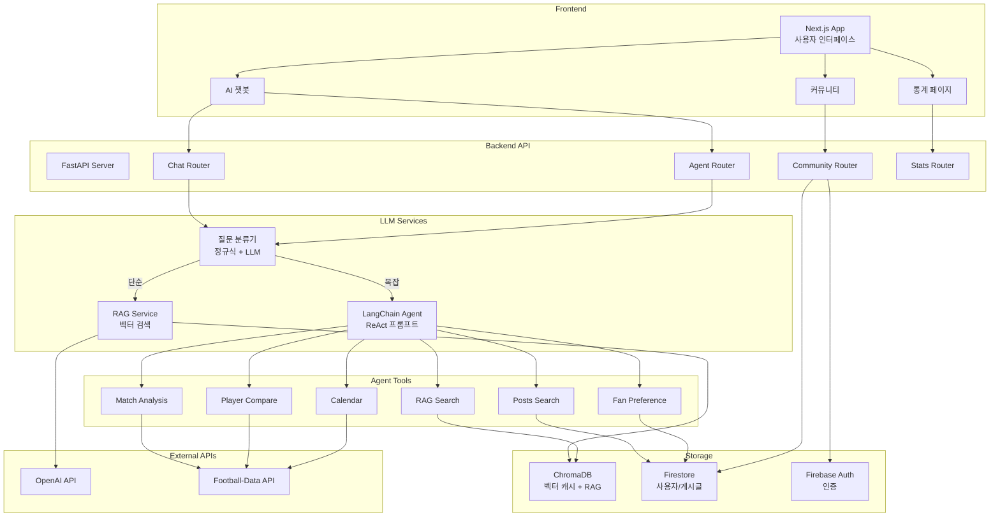
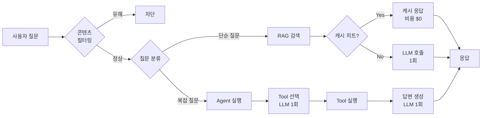
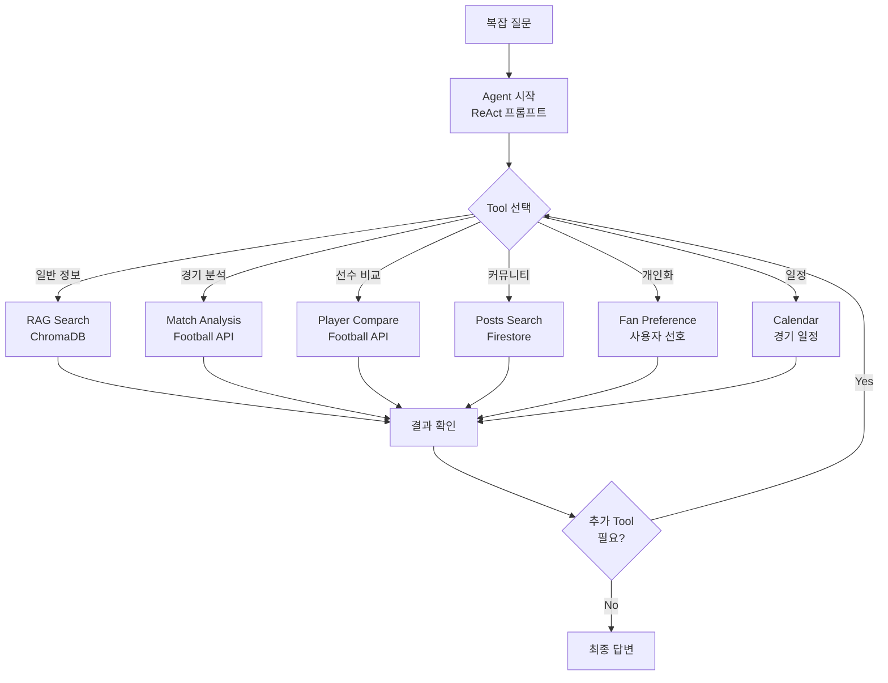
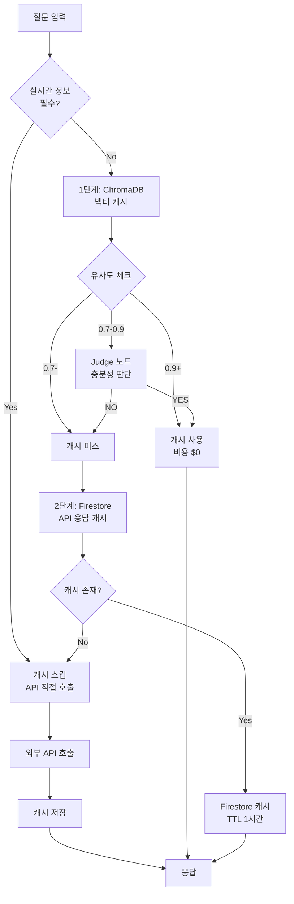

# ⚽ FSF - AI 기반 축구 팬 통합 허브 플랫폼

> **축구 팬들의 '장'**: 정보, 소통, 그리고 연결을 한 곳에서

---

## 🎯 프로젝트 개요

**축구 팬들을 위한 원스톱 통합 허브 플랫폼**

AI 기반 축구 정보 제공, 팬 커뮤니티, 그리고 미래의 B2B 파트너 연결까지
축구를 사랑하는 모든 사람들이 모이는 **'장(場)'**을 만듭니다.

### 핵심 가치 제안
- 🤖 **AI 챗봇**: 축구 관련 모든 질문에 즉시 답변 (RAG + Agent)
- 💬 **팬 커뮤니티**: 자유로운 소통 공간 + AI 기반 콘텐츠 안전 시스템
- 📊 **실시간 정보**: 경기 일정, 선수 통계, 팀 분석
- 🔗 **확장 가능**: 동호회, 티켓 예매, 여행 서비스 연결 (미래)

---

## 🛠️ 기술 스택

**Frontend**
- Next.js 14 (App Router)
- TypeScript
- Zustand (상태 관리)
- TailwindCSS + Radix UI

**Backend**
- Python 3.11+
- FastAPI (RESTful API)
- LangChain + LangGraph (AI Agent)

**AI/ML**
- OpenAI GPT-4o-mini (LLM)
- text-embedding-3-small (임베딩)
- ChromaDB (벡터 DB + RAG)

**Infrastructure**
- Vercel (Frontend 배포)
- Firebase Auth (인증)
- Firestore (사용자/커뮤니티 데이터)
- ChromaDB (벡터 캐시 + RAG)

---

## 🎯 주요 기능

### 1. AI 챗봇 (하이브리드 질문 분류)
- 정규식 기반 빠른 판단 → LLM 폴백
- 단순 질문: RAG 검색 → 1회 LLM 호출
- 복잡 질문: Agent + Tool 자동 선택
- 2단계 캐싱으로 90% 비용 절감

### 2. 콘텐츠 안전 시스템
- 욕설/비방 실시간 필터링
- AI Agent 기반 신고 처리 (무분별한 신고 방지)
- 사용자 신뢰도 점수 관리

### 3. 팬 커뮤니티
- 자유 게시판 + 경기 토론
- 댓글/대댓글 시스템
- 신고 기능 (게시글/댓글/유저)

### 4. 실시간 축구 정보
- Football-Data API 연동
- 경기 일정 및 결과
- 선수 통계 비교

---

## 🏗️ 시스템 아키텍처

---

## 🔄 질문 처리 워크플로우

---

## 🧠 Agent Tool 워크플로우

---

## 💾 캐싱 전략

---

## 📊 성과 지표

### 성능 최적화
| 지표 | Before | After | 개선율 |
|------|--------|-------|--------|
| 응답 속도 | 350ms | 50ms | **7배 향상** |
| 캐시 히트율 | - | 90% | - |
| API 비용 | 100% | 60% | **40% 절감** |
| 정답률 | 90-95% | 97.9% | **2-8% 향상** |

### 핵심 기술 성과
- ⚡ **정규식 기반 빠른 판단**: 비용 $0으로 단순 질문 분류
- 🎯 **2단계 캐싱**: ChromaDB + Firestore 조합
- 🧠 **Judge 노드**: 유사도 0.7-0.9 구간 하이브리드 최적화
- 🔧 **Agent Tool 6개**: 다양한 축구 정보 자동 수집

---

## 🚀 확장 계획

### Phase 1: 현재 (MVP)
- ✅ AI 챗봇 (RAG + Agent)
- ✅ 기본 커뮤니티
- ✅ 신고 시스템

### Phase 2: 커뮤니티 강화
- ⏳ 동호회/클럽 기능
- ⏳ 사용자 프로필 확장
- ⏳ 배지/신뢰도 시스템

### Phase 3: B2B 파트너십
- 📋 티켓 예매 연결
- 📋 여행사 연동
- 📋 축구용품 추천

---

## 🔗 관련 문서

- [📘 PROJECT_HANDBOOK.md](./PROJECT_HANDBOOK.md) - 개발 지침서
- [📊 BUSINESS_PLAN_2026.md](./BUSINESS_PLAN_2026.md) - 사업 계획서

---

**Built with ❤️ for Football Fans**

*FSF - Football Service for Fans*

