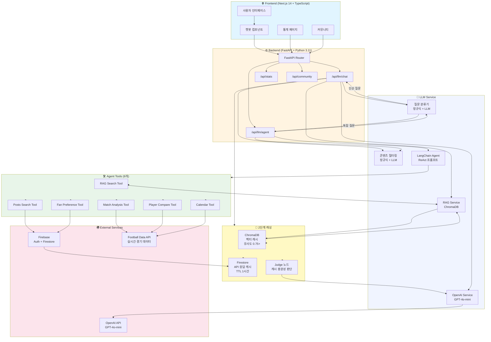
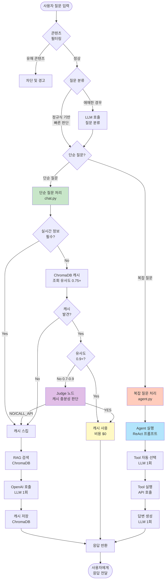
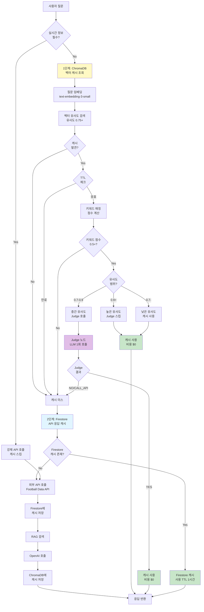
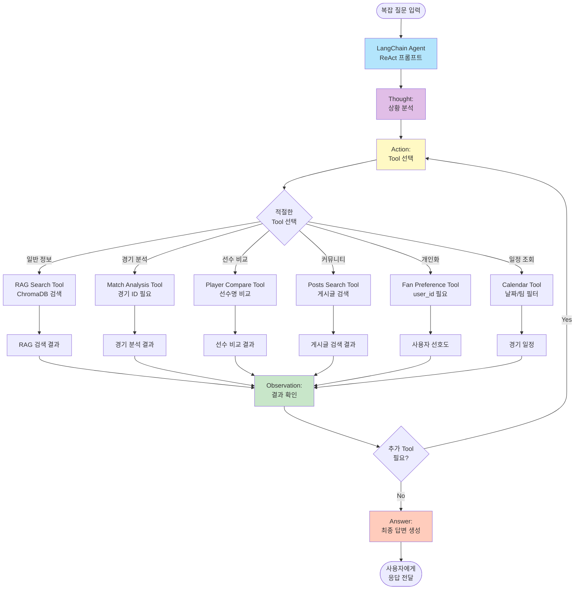
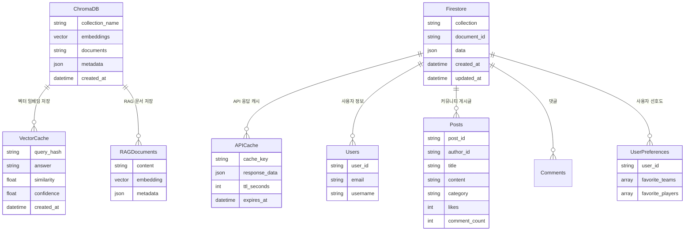
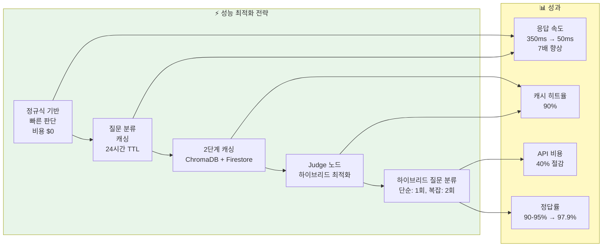

# FSF 프로젝트 아키텍처 다이어그램

## 1. 전체 시스템 아키텍처

## 2. 질문 처리 플로우 (단순 vs 복잡)

## 3. 캐싱 전략 상세 플로우

## 4. Agent Tool 선택 플로우

## 5. 데이터베이스 및 저장소 구조

## 6. 성능 최적화 전략

## 주요 구성요소 설명

### Frontend
- **Next.js 14 App Router**: 서버 사이드 렌더링 및 라우팅
- **TypeScript**: 타입 안정성
- **Zustand**: 상태 관리
- **TailwindCSS**: 스타일링

### Backend
- **FastAPI**: 고성능 비동기 API 서버
- **Python 3.11+**: 최신 Python 기능 활용

### LLM Service
- **질문 분류기**: 정규식 기반 빠른 판단 + LLM 폴백
- **RAG Service**: ChromaDB 기반 벡터 검색
- **OpenAI Service**: GPT-4o-mini 호출
- **Agent**: LangChain 기반 ReAct 프롬프트

### Agent Tools (6개)
1. **RAG Search Tool**: 일반 축구 정보 검색
2. **Match Analysis Tool**: 경기 분석
3. **Player Compare Tool**: 선수 비교
4. **Posts Search Tool**: 커뮤니티 게시글 검색
5. **Fan Preference Tool**: 사용자 선호도 기반 추천
6. **Calendar Tool**: 경기 일정 조회

### 캐싱 전략
- **1단계: ChromaDB 벡터 캐시**
  - 유사도 0.75 이상 캐시 후보
  - Judge 노드로 최종 판단 (유사도 0.7-0.9)
  - TTL: 7일
- **2단계: Firestore API 캐시**
  - 외부 API 응답 캐싱
  - TTL: 1시간

### 성능 지표
- **응답 속도**: 350ms → 50ms (7배 향상)
- **캐시 히트율**: 90%
- **API 비용 절감**: 40%
- **정답률**: 90-95% → 97.9%
